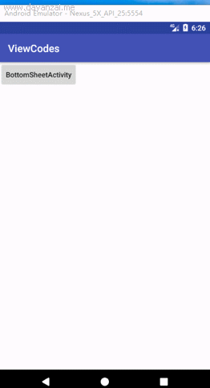

Android Support Library 23.2里的 Design Support Library新加了一个BottomSheet，BottomSheetDialog和BottomSheetDialogFragment。可以在屏幕底部创建一个可滑动关闭的视图。  

BottomSheets其实也是依赖于Behavior机制的使用，先引用依赖design包。

```
 implementation 'com.android.support:design:27.1.1'
```

先来看一下效果：



### 一、BottomSheet

在布局文件xml中的使用,BottomSheets需要配合CoordinatorLayout控件，使用bottom_sheet_behavior。


**layout_bottom_sheet.xml：**

```
<android.support.design.widget.CoordinatorLayout
    xmlns:android="http://schemas.android.com/apk/res/android"
    xmlns:app="http://schemas.android.com/apk/res-auto"
    android:id="@+id/cl"
    android:layout_width="match_parent"
    android:layout_height="match_parent"
    android:fitsSystemWindows="true">

    <android.support.v4.widget.NestedScrollView
        android:id="@+id/bottom_sheet"
        android:layout_width="match_parent"
        android:layout_height="wrap_content"
        app:behavior_hideable="true"
        app:behavior_peekHeight="50dp"
        app:layout_behavior="@string/bottom_sheet_behavior">

        <include layout="@layout/layout_bottom_sheet_dialog"/>
    </android.support.v4.widget.NestedScrollView>

</android.support.design.widget.CoordinatorLayout>
```

**layout_bottom_sheet_dialog ：**


```
<LinearLayout
    xmlns:android="http://schemas.android.com/apk/res/android"
    android:layout_width="match_parent"
    android:layout_height="wrap_content"
    android:orientation="vertical">


    <TextView
        android:layout_width="match_parent"
        android:layout_height="40dp"
        android:background="@color/colorAccent"
        android:gravity="center"
        android:text="拖拽我试试"
        android:textColor="#ffffff"/>


    <TextView
        android:layout_width="match_parent"
        android:layout_height="600dp"
        android:background="@color/colorAccent"
        android:gravity="center"
        android:text="BottomSheet"
        android:textColor="#ffffff"
        android:textSize="25dp"/>


</LinearLayout>
```


这样即完成了BottomSheet的使用。注意下面的三个属性：

```
app:behavior_hideable="true" //当我们拖拽下拉的时候，bottom sheet是否能全部隐藏
app:behavior_peekHeight="0dp"  //当Bottom Sheets关闭的时候，底部我们能看到的高度,默认是0不可见
app:layout_behavior="@string/bottom_sheet_behavior" //代表这是一个BottomSheets
```


### 二、BottomSheetDialog


代码:


```java

  BottomSheetDialog bottomSheetDialog = new BottomSheetDialog(this);
  View view = LayoutInflater.from(this).inflate(R.layout.layout_bottom_sheet_dialog, null);
  Display display = getWindowManager().getDefaultDisplay();
  Point point = new Point();
  display.getSize(point);//获取屏幕宽高
  // 注意最外层的根部局在xml中设置高度会无效，会根据子View高度去适应。所以要设置具体高度可以通过代码LayoutParams去设置
 /* ViewGroup.LayoutParams layoutParams = new LinearLayout.LayoutParams(point.x,point.y);
  view.setLayoutParams(layoutParams);*/
  bottomSheetDialog.setContentView(view);

  BottomSheetBehavior behavior = BottomSheetBehavior.from((View) view.getParent());
  behavior.setPeekHeight(point.y * 1 / 7);  //设置折叠状态时的高度
  behavior.setHideable(false);  //当我们拖拽下拉的时候，bottom sheet是否能全部隐藏

  behavior.setBottomSheetCallback(new BottomSheetBehavior.BottomSheetCallback() {

      /**
       * @param bottomSheet
       * @param newState  STATE_DRAGGING = 1    : 拖曳
       *                  STATE_SETTLING = 2    : 固定
       *                  STATE_EXPANDED = 3    : 完全展开
       *                  STATE_COLLAPSED = 4   ：折叠
       *                  STATE_HIDDEN = 5      ：隐藏
       */
      @Override
      public void onStateChanged(@NonNull View bottomSheet, int newState) {
          switch (newState) {
              case BottomSheetBehavior.STATE_DRAGGING:
                  Log.d("=======onStateChanged", "拖曳");
                  break;
              case BottomSheetBehavior.STATE_EXPANDED:
                  Log.d("=======onStateChanged", "完全展开");
                  break;
              case BottomSheetBehavior.STATE_COLLAPSED:
                  Log.d("=======onStateChanged", "折叠");
                  break;
              case BottomSheetBehavior.STATE_HIDDEN: //  隐藏状态是指内容View隐藏了，所以下滑隐藏时，还会有一个黑色透明的遮罩层。所以要监听STATE_HIDDEN状态，dismiss掉。
                 dismiss();
                 break;
         
      }

      @Override
      public void onSlide(@NonNull View bottomSheet, float slideOffset) {
          Log.d("=======onSlide", slideOffset + "");
      }
  });

  bottomSheetDialog.show();

```


### 三、BottomSheetDialogFragment

BottomSheetDialogFragment和BottomSheetDialog使用基本一样，只不过是在BottomSheetDialog进行了二次封装具有了fragment特性。


代码：

```java
public class MBottomSheetDialogFragment extends BottomSheetDialogFragment {

   private BottomSheetBehavior mBehavior;

    @Override
    public Dialog onCreateDialog(Bundle savedInstanceState) {
        return getBottomSheetDialog(savedInstanceState);
    }


    public BottomSheetDialog getBottomSheetDialog(Bundle savedInstanceState) {
        BottomSheetDialog bottomSheetDialog = (BottomSheetDialog) super.onCreateDialog(savedInstanceState);
        View view = View.inflate(getContext(), R.layout.layout_bottom_sheet_dialog, null);
        Display display = getActivity().getWindowManager().getDefaultDisplay();
        Point point = new Point();
        display.getSize(point); //获取屏幕宽高
        ViewGroup.LayoutParams layoutParams = new LinearLayout.LayoutParams(point.x, point.y * 2 / 3); //设置最大高度
        view.setLayoutParams(layoutParams);
        bottomSheetDialog.setContentView(view);
        mBehavior = BottomSheetBehavior.from((View) view.getParent());
        behavior.setPeekHeight(point.y * 1 / 10); //设置折叠状态时的高度
      
        return bottomSheetDialog;
    }
    
     @Override
    public void onStart()
    {
        super.onStart();
        mBehavior.setState(BottomSheetBehavior.STATE_EXPANDED);//全屏展开
    }


}
```

