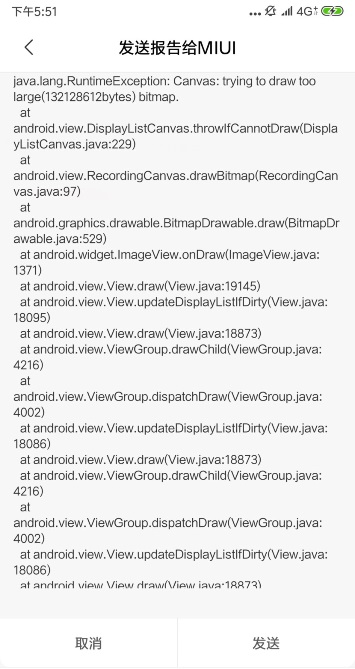

# Android加载大图片防止OOM处理方式


---

对于Android应用来说，加载大图片一直是老少常谈的问题了。因为现在的手机的摄像头像素越来越高，拍的照片像素也越来越高，而像素越高，加载显示所需要占用的内存也会越来大。但是应用所占用的内存资源是有限的。因此加载大图时经常导致程序占用内存过大导致OOM（OutOfMemory）异常。
而且还有可能直接报加载图片过大的异常。如下图小米Mix2加载2K图片是报的异常。  



因此为了避免这个现象，就要大图片的加载进行适当的处理。处理方式：
> * 对图片的像素点数量进行压缩


#### 对图片的像素点数量进行压缩
  BitmapFactory这个类提供了多个解析方法。
  

 -  decodeFile():    读取SD卡图片 
 -  decodeStream():   读取网络上的图片
 -  decodeResource(): 读取资源文件的图片
 
这些方法都会尝试为依据构建的bitmap分配内存，如果直接调用就很有可能导致OOM。  
**那有办法可以不读取Bitmap文件(不分配内存)，但有知道图片的大小吗？**    
答案是有的。  
为此每一种解析方法都提供了一个可选的BitmapFactory.option参数，将这个参数的inJustBounds属性设置为true就可以为解析方法禁止bitmap分配内存，返回值也不再是一个Bitmap对象，而是null。虽然Bitmap是null了，但是BitmapFactory.options的outWidth，outHeight，outMimeType属性都会被赋值。这样我们就可以在记载图片前就可以获取到图片的长款值和MIME类型，从而根据情况进行压缩。如下代码所示：

```java
 BitmapFactory.Options options = new BitmapFactory.Options();
 options.inJustDecodeBounds = true;
 Bitmap bitmap = BitmapFactory.decodeResource(getResources(), R.drawable.img, options); // null

 int width = options.outWidth;// 1920
 int height = options.outHeight;// 1080
 String outMineType =options.outMimeType;//image/png
```

因此，为了避免OOM，最好在解析每张图片的时候都先检查图片的大小，除非你非常信任图片的来源，保证这些图片不会超出你程序的可用内存。

比如你的ImageView控件只有128x96大小，但把一张1280x720的图片完全加载进来是没必要的。这时应该根据控件宽高把图片压缩到最合适的尺寸进行加载。

这时就需要用到BitmapFactory.Options的inSampleSize的值就可以实现。假如一张像素2048x1536的图片，将inSampleSize设置为4，就可以把这张图片压缩为512x384像素（宽高各压缩为原来1/4），那这样图片的内存大小就可以缩小16倍了。可以通过以下公式计算：
> 假设图片的是ARGB_8888类型，一共32位，也就是4字节
>
> 2048 x 1536 x 4 ÷ 1024 ÷ 1024 = 12M
>
> 512 x 384 x 4 ÷ 1024 ÷ 1024 = 0.75M

 
下面方法就是计算合适的inSampleSize:


```
 public int caculateInSampleSize(BitmapFactory.Options options, int reqWidth, int reqHeight) {
        int imgWidth = options.outWidth;
        int imgHeight = options.outHeight;
        int widthSampleSize = Math.round((float) imgWidth / (float) reqWidth);
        int heightSampleSize = Math.round((float) imgHeight / (float) reqHeight);
        int sampleSize = 1;
        if (widthSampleSize > 1 && heightSampleSize > 1) {
            sampleSize = widthSampleSize > heightSampleSize ? heightSampleSize : widthSampleSize;
        }
        return sampleSize;
}
```

那获取到inSampleSize之后，就要它把应用到加载图片中：

```
public Bitmap decodeSampleBitmapFromResource(int resId, int reqWidth, int reqHeight) {

        BitmapFactory.Options options = new BitmapFactory.Options();
        options.inJustDecodeBounds = true;
        BitmapFactory.decodeResource(getResources(), resId, options);
        int sampleSize = caculateInSampleSize(options, reqWidth, reqHeight);
        options.inSampleSize = sampleSize;
        options.inJustDecodeBounds = false;
        return BitmapFactory.decodeResource(getResources(), resId, options);
}
```

然后我们就可以是调用这个方法去处理加载大图片了：

```
 ImageView iv = (ImageView) findViewById(R.id.iv);
 iv.setImageBitmap(decodeSampleBitmapFromResource(R.drawable.img, 200, 200));
```


我们来测试下压缩前后图片需要分配内存的大小情况：


```
 Bitmap originalBitmap = BitmapFactory.decodeResource(getResources(), R.drawable.img);
 Bitmap simpleBitmap = decodeSampleBitmapFromResource(R.drawable.img, 200, 200);

 int originalSize = originalBitmap.getAllocationByteCount(); //132128612  原图大小
 int simpleSize = simpleBitmap.getAllocationByteCount();// 2071160 压缩后大小
```
>  **132128612 ÷  2071160 = 64**    显然图片的宽高各压缩了8倍  


