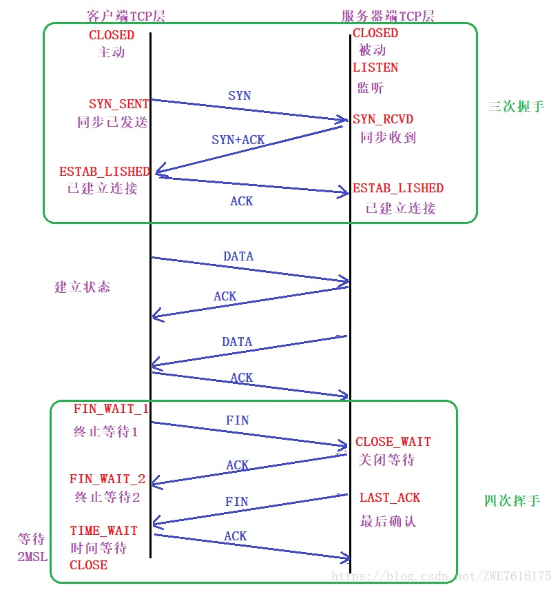
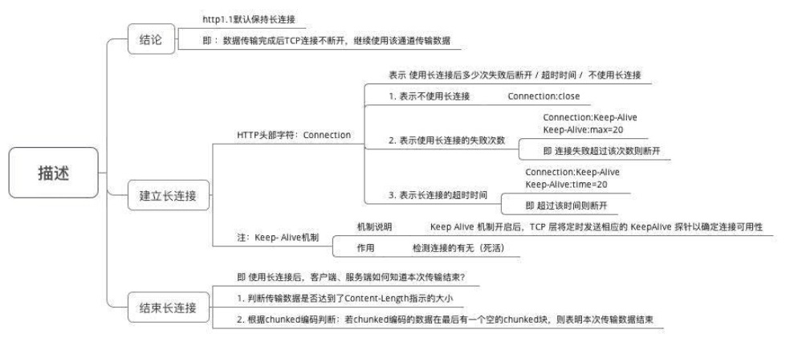

## HTTP 详解

[TOC]

### 1. 计算机网络体系结构
计算机网络体系结构分为三种:
> OSI 体系结构(七层结构) :  1.物理层--> 2.链路层--> 3.网络层-->4.传输层-->5.会话层-->表示层-->应用层  
>
> ***TCP/IP体系结构*:  1.网络接口层 --> 2.网际层 --> 3. 运输层 --> 4. 应用层**
>
> 五层体系结构： 1.网络层 --> 2.链路层 --> 3.网络层 --> 4.运输层 --> 5.应用层

下面来详细说下 TCP/IP体系结构：

层级 | 作用 | 协议（部分）
---|---|---
1.网络接口层 | 负责与链路的数据传输的工作    （如将数据封装成帧，在链路上传输数据）|/
2.网际层 | 为分组交换网上的不同主机提供通信服务（如选择合适路由器）| **IP协议**：提供网络节点之间的报文传送服务
3.运输层 | 为不同主机之间提供通信服务 | **TCP协议**： 提供用户间面向连接，可靠的报文传输 ；  **UDP协议：** 提供用户间无连接，不可靠的报文传输服务
4、应用层| 定义应用间进程通信&交互的规则| **HTTP协议**： 提供Internet网浏览服务； DNS协议：负责域名和IP地址的解析
    

 

---

 

### 2. HTTP协议介绍
#### 2.1 协议通信的基础模型
> HTTP协议传输信息的基础是 **TCP/IP** 体系结构。

#### 2.2 简介（定义、作用、特点）

1. 定义
> HyperText Tansfer Proctol ,一直超文本传输协议

2. 作用：
> 规定了应用进程间通信的准则

3. 特点：

> - 传输效率高 
>    - 无连接：交换Http报文前，不需建立HTTP连接
>   - 无状态：数据传输过程中，不保存任何历史&状态信息
>   - 传输格式简单：请求时，只需传输请求方法 & 路径
> - 传输可靠性高
>    - 采用TCP作为运输层协议。注意：TCP协议：面向连接、可靠传输。交换报文时需预先建立TCP连接(三次握手)
> - 其它： 如兼容性好，支持C/S模式，允许传输任意类型的数据对象

#### 2.3 TCP连接：三次握手，四次挥手

连接用到的几个符号：  
- SYN 连接建立时用于同步序号
- ACK 确认报文
- FIN 终止报文

图示：

**三次握手：** 

> 1. 服务端通过Socket，bind，listen准备接受外来的连接，此时服务器状态为Listen
> 2. 第一次握手： 客户端发起连接请求后，会先给服务端**发送**一个SYN包。
> 3. 第二次握手： 服务端收到SYN包，会回复SYN包的ACK，同时再发送SYN，但SYN和ACK是一起**发送**的。
> 4. 第三次握手： 客户端确认服务端的SYN和ACK，然后**发送**ACK，客户端状态ESTABLISHED
> 5. 服务器接收到ACK，服务器状态ESABLISHED。

**四次挥手**：

关闭连接时，无论是客户端还是服务端都可以发起关闭连接请求。

过程 :
> 1.某端发起关闭请求时，会首先调用close，成为主动关闭端。然后向另一端发送一个FIN（表示发送数据完毕）。 此时主动关闭端状态为FIN_WAIT_1。
>
> 2.接收到FIN的是被动关闭端，在接收到FIN之后会立即发送ACK。主动关闭端接收到ACK状态变为FIN_WAIT_2。
>
> 3.一段时间后，被动关闭端调用close关闭套接字， 向主动关闭端发送FIN，接收端状态为LAST_ACK。
>
> 4.主动关闭端接收到FIN，状态变为TIME_WAIT，并向被动关闭端发送ACK。被动关闭端接收到ACK关闭TCP，而主动关闭端一段时间后也关闭TCP。

为什么建立连接只需握手三次，而关闭连接需要挥手四次。
> 答： 因为建立连接时，服务端可以把ACK和SYN（ACK起确认作用，SYN起同步作用）同时发送。
而关闭连接时，当收到主动关闭端的FIN报文通知时，仅仅表示没有数据发送给你了，但你还未必把所有数据都接收了。所以被动关闭端需等到全部接收完数据才能发送FIN报文给主动方。

 

---

 

### 3. HTTP报文详解
HTTP在应用层交互数据方式 = 报文。报文分为 请求报文&响应报文，分别用于发送请求&响应请求时。
#### 3.1 请求报文
请求报文分为三部分请求行，请求头，请求体。

##### 3.1.1 请求行
作用：
> 声明请求方法，主机域名，资源路径&协议版本。

类型 | 作用| 具体介绍 | 备注
---|---|--|--
请求方法 | 定义对请求对象的操作 | 请求方法有8种：**GET**,**POST**,**HEAD**,**DELETE**,**PUT**,**TRACE**,**CONNECT**,**OPTION**   若服务器=RESTFUL接口，则一般会用到GET,POST,DELETE,PUT|**GET**： 请求读取“URL标志的信息"   **POST**: 为服务器添加信息   **HEADE**: 请求读取“URL标志信息的首部”的信息   **PU**T: 为指定的URL下添加(存储)一个文档   **DELETE** : 删除指定URL所标志的信息   **TRACE**： 用于进行还回测试的请求报文    **CONNECT**: 用于代理服务器   **OPTION** :请求“选项”的信息
请求路径 | URL中的请求地址部分 |若URL = "https://www.baidu.com/",则请求路径 = / 如URL="https://www.baidu.com/208/home",则请求路径 = /208/home | URL简介： 作用： 表示资源位置&访问资源的方法 组成： <协议>://<主机>/<路径>
协议版本 |定义HTTP的版本号|常用版本： HTTP/1.0，HTTP/1.1，HTTP/2.0

这里说下GET和POST的区别：

使用方式 | 传递参数的长度限制 | 传递参数的数据类型 | 安全性 | 应用场景
---|---|--|--|--
GET | 传递参数长度受限制。发送的数据放在URL后，利用("？")代表URL的结尾&请求参数的开始| 只允许ASCII字符 | 差(因数据直接添加到URL=可见，浏览器中)|数据不敏感，从指定资源请求数据
POST | 不受限制 | 任何类型 | 好(将参数封装在HTTP请求数据中，浏览器无缓存)| 对数据敏感，向指定资源提交数据

示例： 请求报文使用GET方法，URL地址为 = http://www.tsinghua.edu.cn/chn/yxsz/index.htm，版本为HTTP 1.1版本

则请求行是： **GET /chn/yxsz/index.htm HTTP/1.1**

##### 3.1.2 请求头
作用：
> 声明 客户端，服务端/报文部分信息

使用方式： 
> 采用“header(字段名) : value(值)”的方式

常用请求头：

1.请求和响应报文的通用Header

名称 | 作用
---|---
Content-Type | 请求体/响应体的类型，如text/plain、application/json
Accept | 说明接收的类型,可以多个值，用，分开
Content-Length | 请求体/响应体的长度
Content-EnCoding | 请求体/响应体的编码格式，如gzip，deflate
Accept-EnCoding | 告知对方我方接收的Content-EnCoding
ETag | 给对方资源的标识，和Last-Modified、If-None-Match、If-Modified-Since配合,用于缓存控制
Cache-Control | 取值一般为no-cache 或max-age=XX,XX为整数，表示该资源缓存有效期(秒)

2.常见的请求Header

名称 | 作用
---|---
Authorization | 用于设置身份验证信息
User-Agent| 用户标识，如：OS和浏览器的类型和版本
If-Modified-Since | 值为上次服务器返回的Last-Modified值，用于确认某个资源是否被更改过，没有更改过(304)就从缓存获取
If-None-Match | 值为上一次服务器返回的 ETag值，一般会和If-Modified-Since一起出现
Referer | 表示请求引用自哪个地址，比如 你从页面A跳转到页面B时，值为页面A的地址
HOST | 请求的主机和端口号

示例：

URL地址 ： http://www.tsinghua.edu.cn/chn/yxsz/index.html

Host ： www.tsinghua.edu.cn (表示主机域名） 

User - Agent：Mozilla/5.0 (表示用户代理是使用Netscape浏览器）

##### 3.1.3 请求体
作用：
> 存放需发送给服务器的数据信息

这是可选部分，如GET请求就无请求数据。

使用方式 ： 3种。
- 数据交换
- 键值对
- 分部分形式

#### 3.2 响应报文
响应报文分为状态行，响应头，响应体。

响应报文和请求报文最大的不同之处在于 状态行& 请求行。

##### 3.2.1 状态行
作用：
> 声明协议版本，状态码，状态信息。

类型 | 作用 | 介绍 | 备注
---|---|--|--
协议版本 | 表示服务器HTTP协议的版本 | 常用版本 HTTP/1.0，HTTP/1.1，HTTP/2.0|/
状态码 ： 状态信息 | 服务器返回的响应状态代码 ： 对状态码的对应解释 | 3为十进制数字组成，分为5大类   **1xx** : 表示信息通知，表示请求收到了或者请求正在处理  **2xx**: 表示成功。如接收了   **3xx**：表示重定向，如要完成请求还必须采取下一步行动  **4xx**: 表示客户端错误，请求包含语法错误/无法实现  **5xx**:表示服务器错误。服务器不能实现一种明显无效的请求。|**200**：请求成功，请求内容与该响应一起返回  **202**:请求已被接受，但还没处理。   **301**： 请求资源已被永久移到新的位置。   **400**：请求参数有误，当前请求无法被服务器理解。   **401**： 请求需要验证用户。   **403**：不允许访问改地址。  **404**：NotFound  **408**：请求超时  **500**：服务器内部错误

##### 3.2.2 响应头
作用：
> 声明 客户端，服务端/报文部分信息

使用方式： 
> 采用“header(字段名) : value(值)”的方式

常见的响应Header

名称| 作用
---|---
Date| 服务器的日期
Last-Modified | 该资源最后被修改事件
Transfer-EnCoding | 取值一般为chunked，出现在Content-Length不能确定情况下。表示服务器不知响应体的数据大小，一般同时还会出现Content-EnCoding响应头
Set-Cookie| 设置Cookie
Location | 重定向到另一个URL
Server|后台服务器

##### 3.2.3 响应体

作用：

> 存放需返回给客户端的数据信息

使用方式 ： 3种。
- 数据交换
- 键值对
- 分部分形式
- 

 

---

 

### 4.额外知识

#### 4.1 HTTP/1.1 与HTTP/1.0的区别
HTTP 1.1比HTTP1.0多了以下优点：
- 引入持久连接，即在同一个TCP的连接可传送多个HTTP请求&响应
- 多个请求&响应可同时进行、可重叠
- 引入更加多的请求体&响应头

#### 4.2 HTTP 和HTTPS的区别

类型 | 原理 | 功能 | 性能 | 标准端口|   CA申请接口 | URL开头
---|---|--|--|--|--|--
HTTP | 应用层|不加密（明文传输）|不安全|80| 不需|http：//
HTTPS | 传输层| 加密（SSL加密，身份认证） |安全| 443| 需要| https：//

#### 4.3 HTTP 处理长连接的方式

 

---

 

### 完 ！！！

### 参考
-  [计算机网络基础：这是一份详细 HTTP 学习指南](https://blog.csdn.net/carson_ho/article/details/82106781)
-  [TCP三次握手及四次挥手详解](https://blog.csdn.net/ZWE7616175/article/details/80432486)

